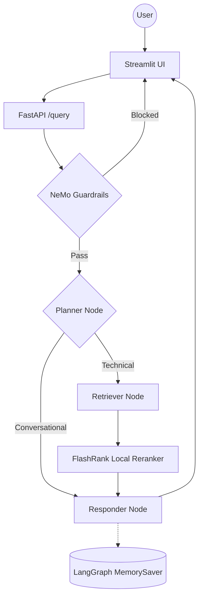

# Enterprise Agentic RAG (Scalable Pipeline)

A production-grade, enterprise-level RAG system built with **LangGraph**, **Portkey LLM Gateway**, and **Gemini Embeddings**. The system distinguishes between technical "True Data" and random "Noisy Data" using semantic re-ranking, history-aware planning, and NeMo Guardrails for input/output safety.

## Key Features

- **Agentic Intelligence**: LangGraph for cyclic reasoning, multi-step planning, and conversation memory.
- **Guardrails**: NeMo Guardrails gate blocks off-topic, jailbreak, and injection inputs before any retrieval.
- **LLM Gateway**: Portkey routes all LLM calls with automatic fallback between primary and backup Groq keys.
- **Enterprise Search**: Qdrant Cloud for high-performance vector search + FlashRank for local semantic reranking.
- **Gemini Embeddings**: Google `gemini-embedding-2-preview` (3072-dim) via `langchain-google-genai`.
- **Local Document Parsing**: PDF, HTML, TXT, DOCX, PPTX parsed entirely on-device — no external OCR service.
- **Observability**: Full trace nesting with **Pydantic Logfire** and **LangSmith** across every agent node.
- **Evaluation Suite**: RAGAS-powered eval pipeline (6 metrics) with a dedicated Streamlit demo app.

---

## Agent Intelligence Flow



---

## Project Structure

```
production_agentic_rag_kubernetes/
├── app/
│   ├── main.py                      # FastAPI backend (endpoints: /, /query, /graph)
│   ├── config.py                    # Centralised settings (API keys, model names, Qdrant config)
│   ├── agents/
│   │   ├── __init__.py
│   │   ├── graph.py                 # LangGraph StateGraph: planner → retriever → responder
│   │   ├── state.py                 # AgentState TypedDict with memory & conversation history
│   │   └── nodes/
│   │       ├── planner.py           # Intent classifier: CONVERSATIONAL vs TECHNICAL
│   │       ├── retriver.py          # Qdrant vector search + FlashRank reranking
│   │       └── responder.py         # LLM response synthesis with Portkey gateway
│   ├── gateways/
│   │   ├── __init__.py
│   │   └── client.py                # Portkey LLM gateway (fallback, cache, retry)
│   ├── guardrails/
│   │   ├── __init__.py
│   │   ├── rails.py                 # NeMo Guardrails initialisation & gate logic
│   │   └── colang_rules.py          # Colang/YAML rules: off-topic, jailbreak, greeting, farewell
│   ├── ingestion/
│   │   ├── __init__.py
│   │   ├── processor.py             # Universal ingestion: parse → chunk → embed → index
│   │   ├── chunking/
│   │   │   ├── __init__.py
│   │   │   └── splitter.py          # Paragraph-aware text chunker (1500-char windows)
│   │   └── loaders/
│   │       ├── __init__.py
│   │       ├── pdf.py               # PDF parser (pypdf + pdfplumber fallback)
│   │       ├── html.py              # HTML parser (BeautifulSoup)
│   │       ├── text.py              # Plain text parser
│   │       └── office.py            # DOCX/PPTX parser (python-docx / python-pptx)
│   └── services/
│       ├── __init__.py
│       └── retrival/
│           ├── __init__.py
│           ├── embedding.py         # Gemini Embeddings (3072-dim) + sentence-transformers fallback
│           ├── quant_service.py     # Qdrant vector search client
│           └── reranking.py         # FlashRank Cross-Encoder reranker (local ONNX)
├── ui/
│   └── app.py                       # Streamlit chat UI with session management & source display
├── eval/
│   ├── __init__.py
│   ├── app.py                       # Streamlit eval dashboard (3-tab: Ground Truth → Pipeline → Metrics)
│   ├── pipeline.py                  # Phase 1: Live API calls for each golden sample
│   ├── metrices.py                  # Phase 2: 6 RAGAS metrics + Tool Correctness (Jaccard)
│   ├── data_paser.py                # Golden dataset builder from enterprise documents
│   ├── guardrails_eval.py           # Guardrails test harness (adversarial + legitimate inputs)
│   ├── golden_dataset.json          # Ground-truth Q&A pairs for evaluation
│   └── og_golden_dataset.json       # Original unmodified golden dataset backup
├── DATA/
│   ├── TRUE_DATA/                   # Enterprise documentation (K8s, job management, architecture)
│   └── NOISY_DATA/                  # Random technical papers for noise-distinction testing
├── processed_data/
│   ├── true/                        # Processed JSON metadata for TRUE_DATA
│   └── noisy/                       # Processed JSON metadata for NOISY_DATA
├── Notebooks/
│   ├── embedding_test.ipynb         # Embedding model exploration
│   ├── guadils.ipynb               # Guardrails experimentation
│   └── porteky_test.ipynb          # Portkey gateway integration testing
├── main.py                          # Entry point (env load, logfire validation)
├── requirements.txt                 # Python dependencies
├── pyproject.toml                   # Project metadata (Python 3.12+, uv-managed)
├── .env                             # Environment variables (API keys, endpoints)
├── .gitignore
├── .python-version
├── TODO.md
├── uv.lock                          # Locked dependency versions (uv)
└── README.md                        # This file
```

---

## Tech Stack

| Layer | Technology |
|-------|-----------|
| Orchestration | LangChain + LangGraph |
| LLMs | Groq (Llama 3.3 70B) via **Portkey** gateway |
| Guardrails | NeMo Guardrails |
| Vector DB | Qdrant Cloud |
| Reranking | FlashRank (local, zero-latency) |
| Embeddings | Gemini `gemini-embedding-2-preview` (3072-dim) |
| Document Parsing | pypdf + pdfplumber (local, no OCR service) |
| Observability | Pydantic Logfire + LangSmith |
| Evaluation | RAGAS + custom Tool Correctness (Jaccard) |

---

## Production-Grade Value Propositions

This system is engineered for **real-world enterprise deployment** with deep resilience and safety guarantees at every layer:

### 1. Agentic Intelligence with LangGraph
A cyclic **planner → retriever → responder** architecture powered by LangGraph. The planner node uses LLM-based intent classification to route queries — conversational chit-chat is handled directly from memory, while technical questions trigger full retrieval. [**`app/agents/graph.py`**](app/agents/graph.py)

### 2. Dual-Layer Safety with NeMo Guardrails
The guardrails gate operates **before any retrieval or LLM inference**. It detects off-topic questions, jailbreak attempts, prompt injections, greetings, and farewells using Colang-defined patterns. A second detection layer uses `RAIL_INDICATORS` string matching on the response for defense-in-depth. Blocked requests never reach the RAG pipeline — saving cost and preventing data leakage. [**`app/guardrails/rails.py`**](app/guardrails/rails.py)

### 3. Enterprise-Grade LLM Gateway via Portkey
All LLM calls route through **Portkey** with:
- **Automatic fallback**: Primary model `@rag/llama-3.3-70b-versatile` → backup `@brag/llama-3.1-8b-instant` on failure
- **Semantic caching**: Cache hits serve responses instantly (zero LLM latency), visible via `x-portkey-cache-status: HIT` headers
- **Retry with exponential backoff**: 2 retry attempts on rate limits before triggering fallback
- **Config-driven**: Portkey config ID (`pc-portke-5dc95e`) in environment variables — no code changes needed to swap providers

[**`app/gateways/client.py`**](app/gateways/client.py)

### 4. Hybrid Search Pipeline — Vector + Cross-Encoder
A two-stage retrieval system:
1. **Qdrant vector search**: Cosine similarity search over 3072-dimensional Gemini embeddings, returning 15 candidates
2. **FlashRank Cross-Encoder reranking**: A local quantized ONNX model (`ms-marco-MiniLM-L-6-v2`) re-scores the top 15 candidates semantically, keeping the top 5. This eliminates the "fuzzy matching" problem of pure vector search while keeping latency under 500ms locally.

[**`app/services/retrival/reranking.py`**](app/services/retrival/reranking.py)

### 5. Resilient Embeddings with Automatic Fallback
Uses **Google Gemini `gemini-embedding-2-preview`** (3072-dimensional) as the primary embedding model. If Gemini is unreachable or rate-limited, the system automatically falls back to **sentence-transformers `all-mpnet-base-v2`** (768-dimensional) — zero manual intervention. The Qdrant collection dimension is resolved at runtime based on which model is active. [**`app/services/retrival/embedding.py`**](app/services/retrival/embedding.py)

### 6. Fully Local Document Ingestion — No External Services
All document parsing happens entirely on-device with **zero external OCR or cloud APIs**:
- **PDF**: `pypdf` with automatic `pdfplumber` fallback for image-heavy pages
- **HTML**: `BeautifulSoup` with intelligent content extraction
- **DOCX/PPTX**: Native Office format parsing via `python-docx` / `python-pptx`
- **Text**: Raw text file support

The ingestion pipeline processes, chunks, embeds, and indexes documents in a single command. [**`app/ingestion/processor.py`**](app/ingestion/processor.py)

### 7. Full Observability — Distributed Tracing
Every node in the LangGraph pipeline is instrumented with **Pydantic Logfire** spans, providing end-to-end trace visibility:
- Guardrails gate decisions (blocked/passed)
- Planner intent classification
- Qdrant search latency and result count
- FlashRank reranking scores and duration
- LLM synthesis time and cache hit/miss status
- **LangSmith** integrates seamlessly for additional trace exploration and debugging

[**`app/main.py`**](app/main.py)

### 8. Conversation Memory with Thread-Based Isolation
LangGraph's **MemorySaver** checkpoint system preserves conversation history per `thread_id`. Each user session gets an isolated memory space, enabling coherent multi-turn conversations without cross-user leakage. [**`app/agents/graph.py`**](app/agents/graph.py)

### 9. Comprehensive Evaluation Suite
A dedicated Streamlit evaluation dashboard (`eval/app.py`) with a **3-step workflow**:
1. **Ground Truth Review** — Visual inspection of golden Q&A pairs from enterprise documents
2. **Live Pipeline Execution** — Sends each golden question to the real API, captures responses, and runs guardrails tests
3. **RAGAS Metrics Scoring** — 6 metrics computed with separate `JUDGE_GROQ` key to avoid exhausting production TPM:
   - Faithfulness, Answer Relevancy, Context Precision, Context Recall, Answer Correctness, Tool Correctness (Jaccard)

Token-aware batching (40s cooldowns between samples) keeps eval runs within Groq's 6,000 TPM on-demand tier. [**`eval/`**](eval/)

### 10. Data Distinction — True vs. Noisy Data
The system is designed to handle **two distinct data categories**:
- **TRUE_DATA**: Curated enterprise documentation (Kubernetes, job management, architecture, networking)
- **NOISY_DATA**: Random technical papers from diverse domains (Intel hardware, operating systems, machine learning, compression algorithms)

This setup validates the system's ability to semantically distinguish relevant enterprise content from generic technical noise — a critical capability for production deployment.

---

## Getting Started

### 1. Install dependencies

```powershell
python -m venv tenvv
.\tenvv\Scripts\activate
pip install -r requirements.txt
```

### 2. Configure environment

Create a `.env` file with the following keys:

```env
# Groq Reasoning Engine (Llama 3.3)
GROQ_API_KEY = ""
GROQ_FALLBACK_API_KEY = ""          # second Groq key, or same as primary

# Portkey LLM Gateway
PORTKEY_API_KEY = ""

# Qdrant Vector DB
QDRANT_API_KEY = ""
QDRANT_CLUSTER_ENDPOINT = ""        # e.g. https://your-cluster.cloud.qdrant.io:6333

# Pydantic Logfire Observability
LOGFIRE_TOKEN = ""

# LangSmith
LANGSMITH_TRACING = true
LANGSMITH_ENDPOINT = https://api.smith.langchain.com
LANGSMITH_API_KEY = ""
LANGSMITH_PROJECT = ""

# Streamlit UI → FastAPI
BACKEND_URL = ""                    # e.g. http://localhost:8000

# Eval judge LLM (keep separate from main key to avoid rate-limiting the live app)
JUDGE_GROQ = ""

# Gemini Embeddings
GEMINI_API_KEY = ""
```

### 3. Run data ingestion

Parses all documents in `DATA/`, chunks them, saves metadata to `processed_data/`, and indexes vectors into Qdrant.

```powershell
python -m app.ingestion.processor DATA --wipe
```

> Pass `--wipe` to drop and recreate the Qdrant collection. Omit it to append to an existing collection.

### 4. Launch the app

```powershell
# Terminal 1 — FastAPI backend
uvicorn app.main:app --reload --port 8000

# Terminal 2 — Streamlit UI
streamlit run ui/app.py
```

### 5. Run the eval suite (optional)

```powershell
# Requires the FastAPI backend running on :8000
streamlit run evals/app.py
```

----

*Built for High-Scale Enterprise Document Intelligence.*# agentic_rag_high_scale

